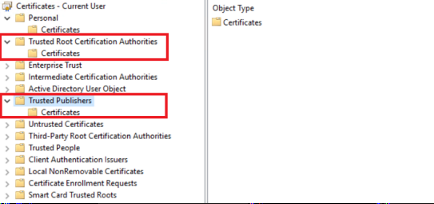
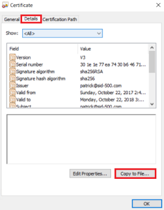
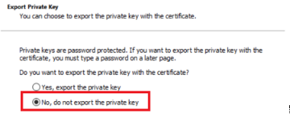
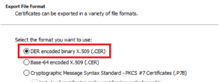
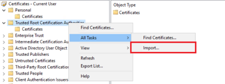
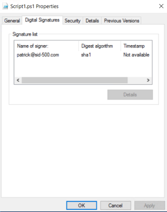

# Digitally Sign Files (PowerShell Example)

From:
- https://sid-500.com/2017/10/26/how-to-digitally-sign-powershell-scripts/

---

### Creating a self-signed Certificate
Open Windows PowerShell and run the following One-Liner to create a signing certificate.
```
New-SelfSignedCertificate -DnsName patrick@sid-500.com -CertStoreLocation Cert:\CurrentUser\My\ -Type Codesigning
```

You can find your certificate in your certificate store. Run certmgr.msc.
```
C:\> certmgr.msc
```

### Import the Certifcate in Trusted Root Certification Autorities and Trusted Publisher
Now the certificate must be exported and then imported into the Trusted Root Certification Authorities and Trusted Publishers.



Double click on the certificate and select Details and Copy to file …



Do not export the private key. No need for.



Select CER Format.



Save the file wherever you want.
Now import the certificate to the Trusted Root Authorities and Trusted Publishers.




### Sign a file
Next, we use Set-Authenticodesignature to sign our file. In this example, it is a. ps1 file, thus a PowerShell script.
```
Set-AuthenticodeSignature -FilePath C:\Temp\script1.ps1 -Certificate (Get-ChildItem -Path Cert:\CurrentUser\My\ -CodeSigningCert)
```


Don’t worry about the Status Unknown Error. The next time you do it valid comes up. Crazy Stuff. Ok, we don’t care about this now.


Nice. Finally, see what happened. Open Windows Explorer, right click on your file, select properties and click on Digital Signatures.



### Testing your script
For testing your script, make sure the execution policy allows the running of PS1 scripts.
```
Get-ExecutionPolicy
```
Remotesigned, AllSigned and Unrestricted are your friends … If the policy is set to restricted then set it – for this testing environment – to AllSigned.
```
Set-ExecutionPolicy AllSigned
```


---

#powershell